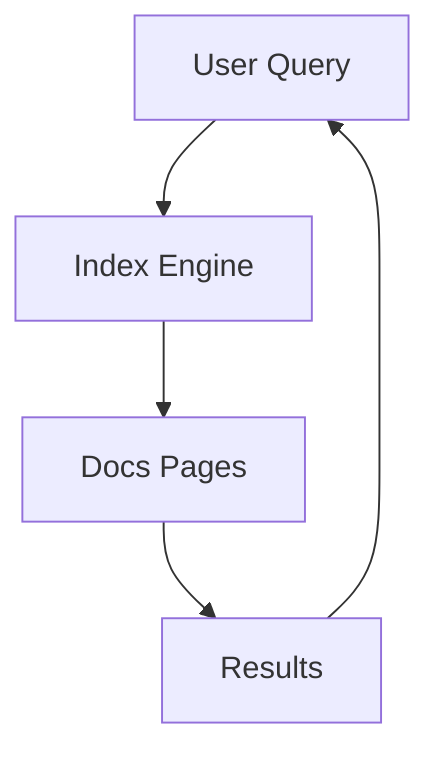

## Overview

John Chen Documentation provides powerful features to streamline your project documentation. You can organize content hierarchically, collaborate seamlessly with teams, manage versions effectively, and ensure content is easily discoverable through robust search tools.

<Callout kind="info">
These core features form the foundation for scalable documentation. Customize them to fit your project's needs.
</Callout>

<Columns cols={2}>
  <Card title="Organized Structure" icon="folder" href="#organization">
    Build intuitive hierarchies for easy navigation.
  </Card>
  <Card title="Team Collaboration" icon="users" href="#collaboration">
    Share and review docs with your team effortlessly.
  </Card>
  <Card title="Version Control" icon="git-branch" href="#version-control">
    Track changes like code with integrated versioning.
  </Card>
  <Card title="Advanced Search" icon="search" href="#search">
    Find content instantly across your entire docs site.
  </Card>
</Columns>

## Document Organization and Hierarchy

Create a clear structure using folders and pages. Nest sections logically to reflect your project's architecture.

<Tabs>
  <Tab title="Folder Structure" icon="folder">
    Organize docs like this:

    ```
    docs/
    ├── introduction.mdx
    ├── features/
    │   ├── organization.mdx
    │   └── collaboration.mdx
    └── api/
        └── endpoints.mdx
    ```
  </Tab>
  <Tab title="Page Linking" icon="link">
    Link pages with relative paths:

````markdown
[Go to Features](/features/organization)

[View API Docs](/api/endpoints)
````

  </Tab>
</Tabs>

<Callout kind="tip">
Use descriptive file names and frontmatter for better navigation.
</Callout>

## Collaboration and Sharing Options

Invite team members to edit, review, and publish docs together.

<Steps>
  <Step title="Invite Collaborators" icon="user-plus">
    Share your docs space via email or link.
  </Step>
  <Step title="Set Permissions" icon="shield">
    Assign roles like Editor or Viewer.
  </Step>
  <Step title="Publish Changes" icon="globe">
    Preview and deploy updates live.
  </Step>
</Steps>

For public sharing, generate read-only links or embed previews.

## Version Control Basics

Integrate with Git for full change history and rollbacks.

<CodeGroup tabs="Git Commands,MDX Changes">
````bash
# Clone your docs repo
git clone https://github.com/johnchen/docs.git

# Make changes
git add .
git commit -m "Update features page"
git push origin main
````

````mdx
// Before: Simple paragraph
This is basic text.

// After: Enhanced with component
<Card title="New Feature" icon="star">
  Enhanced content.
</Card>
````
</CodeGroup>

<Expandable title="Rollback Example" default-open="false">
Use Git to revert:

````bash
git checkout HEAD~1 -- features.mdx
git commit -m "Revert to previous version"
````

</Expandable>

## Search and Indexing Functionality

Full-text search indexes all pages, frontmatter, and code blocks automatically.

| Feature | Description | Example Query |
|---------|-------------|---------------|
| Keyword Search | Finds exact matches | `hierarchy` |
| Advanced Filters | By section or tags | `tag:feature` |
| Code Search | Searches within blocks | `git clone` |



<Callout kind="success">
Search updates in real-time as you publish new content.
</Callout>

## Best Practices

- Maintain a flat hierarchy where possible to improve searchability.
- Use consistent naming conventions across your docs.
- Review changes via pull requests before merging.

<Columns cols={3}>
  <Card title="Quickstart" icon="rocket" href="/quickstart">
    Set up your first doc.
  </Card>
  <Card title="Authentication" icon="lock" href="/authentication">
    Secure your space.
  </Card>
  <Card title="Changelog" icon="git-commit" href="/changelog">
    Track updates.
  </Card>
</Columns>