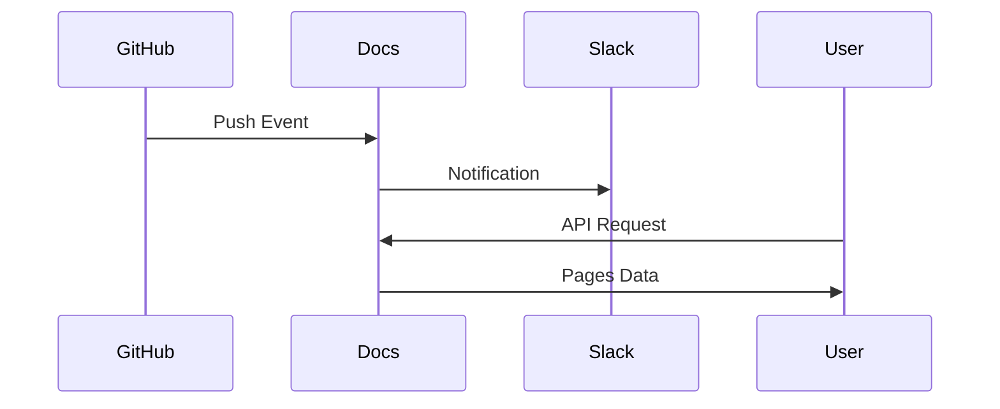

## Overview

Integrate your John Chen documentation with popular third-party services to streamline workflows, receive real-time notifications, and extend functionality. Use webhooks for instant updates, connect to GitHub for version control, or send alerts to Slack. These integrations help you automate content publishing and collaborate efficiently.

<Callout kind="info">
Enable integrations via your dashboard at `https://dashboard.example.com/settings/integrations`. Generate secure tokens and configure endpoints to get started quickly.
</Callout>

## Popular Integrations

Discover ready-to-use connections that supercharge your documentation management.

<Columns cols={3}>
  <Card title="GitHub" icon="github" href="https://github.com" target="_blank">
    Sync documentation changes with your repository. Push updates directly from GitHub Actions to keep docs live.
  </Card>
  <Card title="Slack" icon="message-circle" href="https://slack.com" target="_blank">
    Receive notifications for page updates, new comments, or deployment events in your Slack channels.
  </Card>
  <Card title="Zapier" icon="zap" href="https://zapier.com" target="_blank">
    Build no-code automations connecting docs to 5000+ apps like email, Trello, or Google Sheets.
  </Card>
</Columns>

## Webhook Setup

Set up webhooks to trigger actions on documentation events like page publishes or user logins.

<Steps>
  <Step title="Generate Webhook URL" icon="link">
    Navigate to `https://dashboard.example.com/settings/webhooks` and create a new webhook. Copy the secure URL.
  </Step>
  <Step title="Configure Events" icon="settings">
    Select events such as `page.updated` or `comment.created`.
  </Step>
  <Step title="Test Endpoint" icon="play">
    Send a test payload to verify integration.
  </Step>
</Steps>

Here is a sample webhook payload:

```json
{
  "event": "page.updated",
  "page_id": "doc-123",
  "timestamp": "2024-10-15T10:30:00Z",
  "user_id": "user-456"
}
```

## API Access

Access documentation programmatically using the REST API at `https://api.example.com/v1`.

<Tabs>
  <Tab title="JavaScript" icon="code">
    ```javascript
    const response = await fetch('https://api.example.com/v1/pages', {
      headers: {
        'Authorization': `Bearer ${YOUR_API_KEY}`,
        'Content-Type': 'application/json'
      }
    });
    const pages = await response.json();
    console.log(pages);
    ```
  </Tab>
  <Tab title="Python" icon="python">
    ```python
    import requests

    headers = {
        'Authorization': f'Bearer {YOUR_API_KEY}',
        'Content-Type': 'application/json'
    }
    response = requests.get('https://api.example.com/v1/pages', headers=headers)
    pages = response.json()
    print(pages)
    ```
  </Tab>
</Tabs>

<ParamField path="page_id" param-type="string" required="true">
  Unique identifier for the documentation page.
</ParamField>

<ParamField header="Authorization" param-type="string" required="true">
  Bearer token for authentication. Generate at `https://dashboard.example.com/api-keys`.
</ParamField>

<ResponseField name="pages" field-type="array" required="true">
  List of documentation pages with metadata.
</ResponseField>

<ResponseField name="total" field-type="number">
  Total count of pages.
</ResponseField>

## Embedding External Content

Embed dynamic content from external sources into your docs using iframes or API-driven widgets.

<Expandable title="Advanced Embedding Options" default-open="false">
  Use `<Iframe>` for forms or dashboards:

  ```jsx
  <Iframe
    src="https://forms.example.com/feedback"
    title="Feedback Form"
    width="100%"
    height="500"
  />
  ```

  Customize with query parameters for personalization.
</Expandable>

## Best Practices

- Store `YOUR_API_KEY` securely using environment variables.
- Validate webhook signatures to prevent unauthorized requests.
- Limit API rate to `<1000` requests per hour.

<Callout kind="tip">
Explore more in the [Quickstart](/quickstart) or [Authentication](/authentication) guides for full setup.
</Callout>

